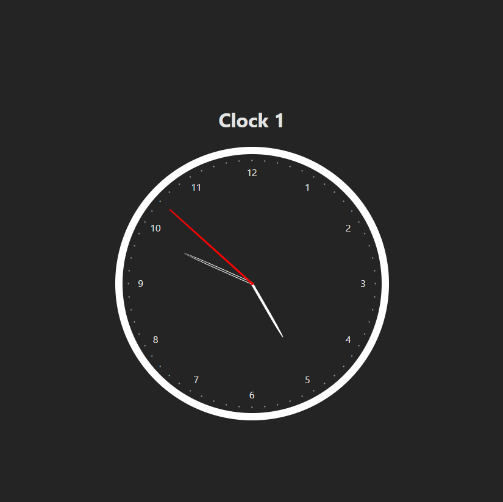
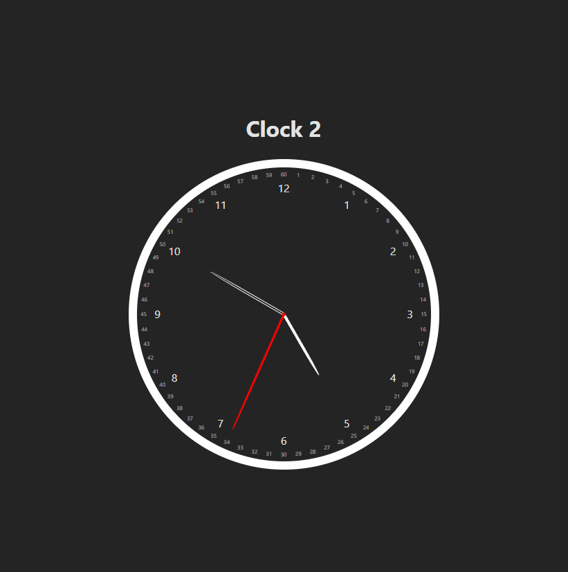

# Clock Component with React and Vite

This is a simple clock component built with React and Vite.
Im using this project to learn about React and Vite.

## Features

- Two styles of clock, analog with seconds with numbers and analog with seconds without numbers

## How to run

1. Clone this repository
2. Run `npm install`
3. Run `npm run dev`
4. Open `http://localhost:5173` in your browser

## Preview of component

