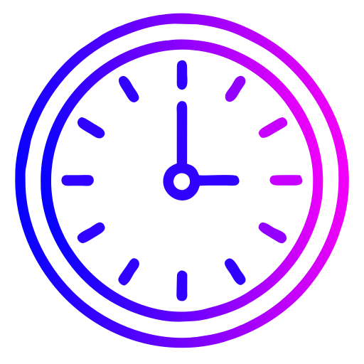
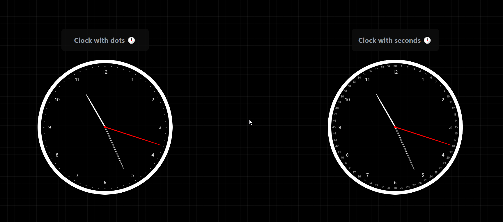
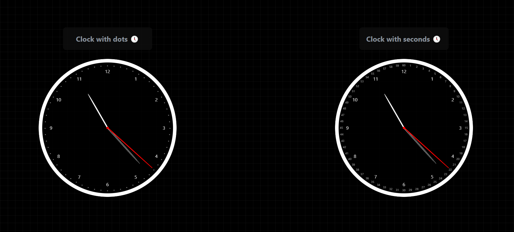

# <div style="display: flex; flex-direction:row; justify-content:center;place-items: center; gap:10px">Clock Component  with React , AtroposJS  & Vite </div>


This is a simple clock component built with React and Vite.
Im using this project to learn about React and Vite.

Im still learning about React and Vite, so if you have any suggestions, please let me know!

If you like this project, please give it a star ⭐ :)

## Features

-  Two styles of clock, analog with seconds with numbers and analog with seconds without numbers 
-  Added Atropos to clocks

## How to run
 
1. Clone this repository 

```
 git clone https://github.com/ShxwZ/Clock-Component-React.git
```


2. Run `npm install`
3. Run `npm run dev`
4. Open `http://localhost:5173` in your browser

## Preview of component



